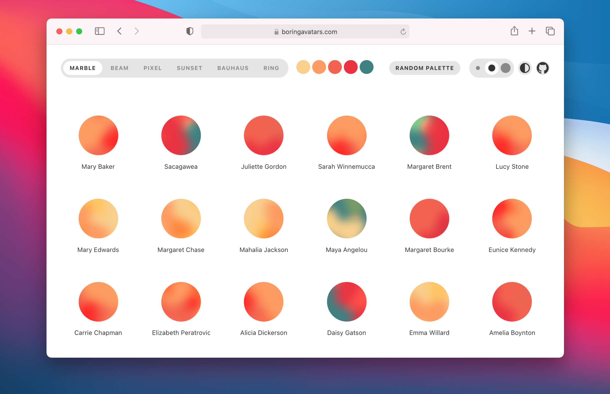

# boring-avatars-vanilla

Boring avatars is a tiny JavaScript library that generates custom, SVG-based avatars from any username and color palette. Works in both browsers and Node.js server-side rendering.



<a href="https://www.npmjs.com/package/boring-avatars-vanilla">


</a>

## Install

```
npm install boring-avatars-vanilla
```

## Usage

```javascript
import boring from 'boring-avatars-vanilla';

const svg = boring({ name: 'Maria Mitchell' });

// Use in browser
document.getElementById('avatar').innerHTML = svg;

// Use in Node.js server-side rendering
fs.writeFileSync('avatar.svg', svg);
```

### Props

| Prop    | Type                                                         | Default                                                   |
|---------|--------------------------------------------------------------|-----------------------------------------------------------|
| size    | number or string                                             | `40px`                                                    |
| square  | boolean                                                      | `false`                                                   |
| title   | boolean                                                      | `false`                                                   |
| name    | string                                                       | `Clara Barton`                                            |
| variant | oneOf: `marble`, `beam`, `pixel`,`sunset`, `ring`, `bauhaus` | `marble`                                                  |
| colors  | array                                                        | `['#92A1C6', '#146A7C', '#F0AB3D', '#C271B4', '#C20D90']` |


#### Name

The `name` prop is used to generate the avatar. It can be the username, email or any random string.

```javascript
boring({ name: 'Maria Mitchell' });
```

#### Variant

The `variant` prop is used to change the theme of the avatar. The available variants are: `marble`, `beam`, `pixel`, `sunset`, `ring` and `bauhaus`.

```javascript
boring({ name: 'Alice Paul', variant: 'beam' });
```

#### Size

The `size` prop is used to change the size of the avatar.

```javascript
boring({ name: 'Ada Lovelace', size: 88 });
```

#### Colors

The `colors` prop is used to change the color palette of the avatar.

```javascript
boring({ name: 'Grace Hopper', colors: ['#fb6900', '#f63700', '#004853', '#007e80', '#00b9bd'] });
```

#### Square

The `square` prop is used to make the avatar square.

```javascript
boring({ name: 'Helen Keller', square: true });
```

## API service

> [!IMPORTANT]  
> Please note that the old service was paused in July 31st 2024. We recommend transitioning to our new API service to ensure uninterrupted access and support.

Get access to the Boring avatars API service [here →](https://boringdesigners.gumroad.com/l/boring-avatars-service).

## License

MIT, Thanks for [boring-avatars](https://github.com/boringdesigners/boring-avatars).
